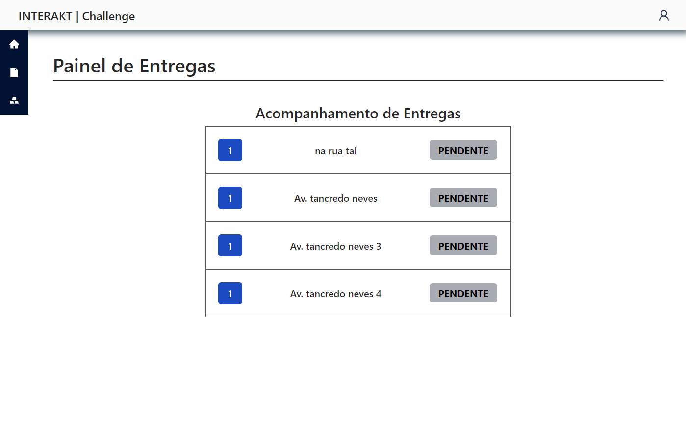
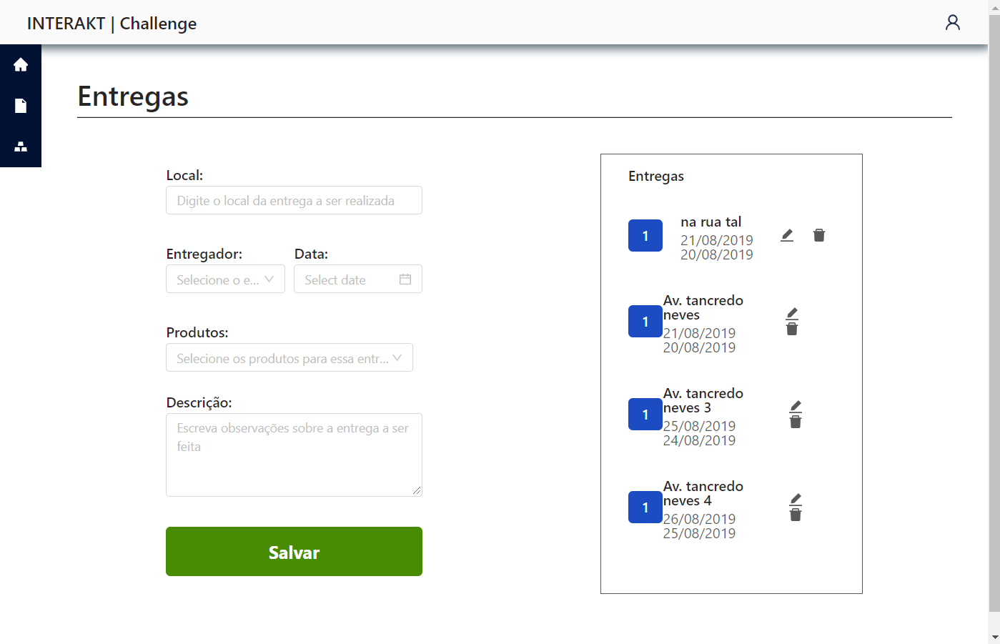
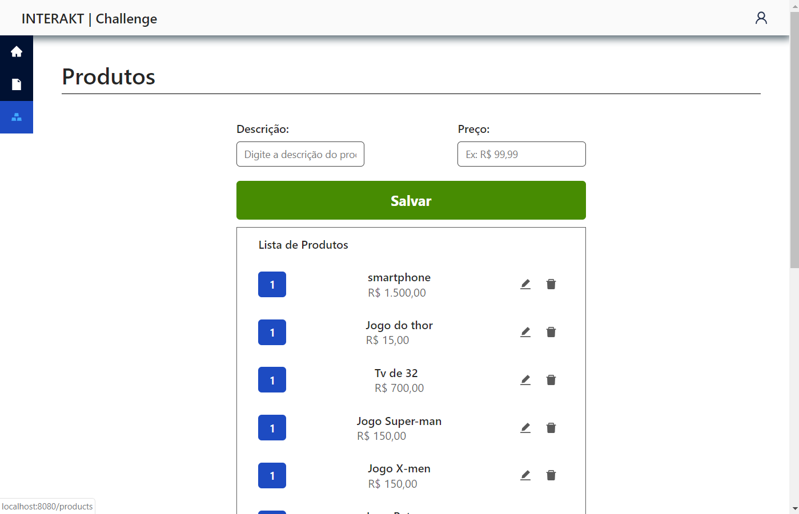

# [Product Delivery](https://interakt-challenge-frontend.herokuapp.com/)

Front-end challenge for job vacancy at INTERAKT company using reactjs and graphql(apollo client)

## Installing / Getting started

```shell
$ git clone https://github.com/gabrieljony/interakt-challenge-frontend.git
$ cd interakt-challenge-frontend/
$ yarn install
```
## Development environment - http://localhost:8080/

```shell
$ yarn run dev
```

## Production environment

```shell
$ yarn run prod
```

## Template the Challenge




